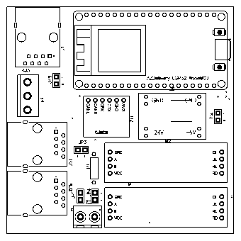
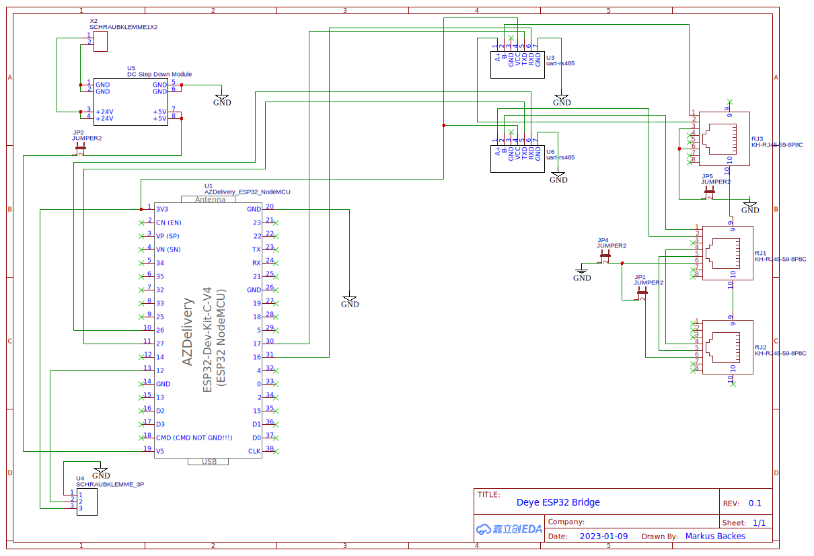
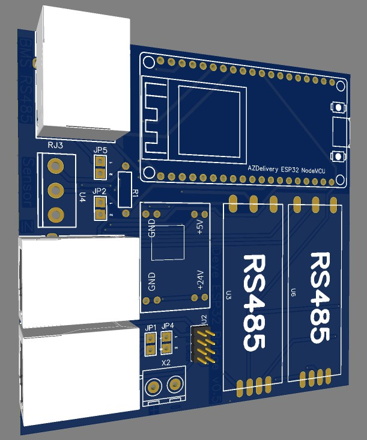

# deye-esp32-bridge

This PCB and Software is used to create a board which communicates with your Deye/Sunsynk inverter and also Seplos BMS.





# BOM
 - PCB (designed with easyeda and produced by jlcpcb)
 - [AZDelivery ESP32 Dev v4](https://amzn.to/41Sd0v4)
 - [2x RS485 Serial Converter](https://amzn.to/3L1OmBq)
 - [DC/DC Step Down Module](https://amzn.to/3oFFiur)
 - [3x RJ45 connectors](https://amzn.to/3AqmPo8)

# Prepare RS485 Serial Converter
Make sure that your RS485 converter is terminated by about 120R. 
Measure the resistance between B- and A+. Should be something between 110-130 Ohms. 
If you cannot measure any resistance, you need to shorten the the two small pins next to the B- connector. 
On my boards it was labled with R13.

# Deye Setup
 - Goto Advanced Function and set to Slave and Modbus SN 01

# Flash ESP32
 - Adapt your wifi settings in the secrets.yaml
 - Connect your PC to the micro USB and run: ```esphome run deye-esp32-bridge.yaml```

# Wiring
 - Connect any 7-24V DC source to the screw headers (CN2 PINS 7+8 from deye inverter will work). Make sure that JP2 is closed.
 - As an alternative you can connect directly to the USB of the ESP32. Make sure that JP2 is not closed.
 - Connect your inverters BMS RJ45 to the CAN IN RJ45 of the PCB.
 - If you want to connect your inverter and BMS via CAN. connect your BMS to the BMS IN RJ45 of the PCB.
 - Connect your Seplos BMS to RJ3
 
# Software
 - The esphome configuration file for deye is based on the work of klatremis (https://github.com/klatremis/esphome-for-deye)
 - The esphome configuration file for seplos is based on the work of syssi (https://github.com/syssi/esphome-seplos-bms)
 
# Disclaimer

This repository contains files for demonstration purposes only. Use the files on your own risk. I am not responsible for any damage!


