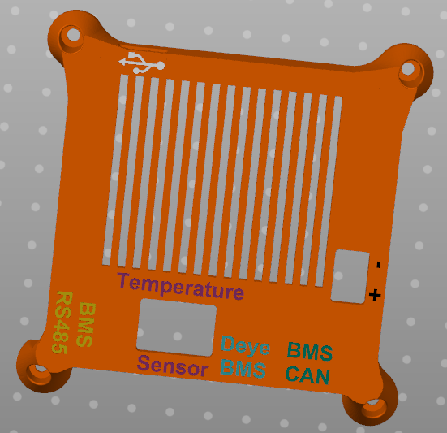
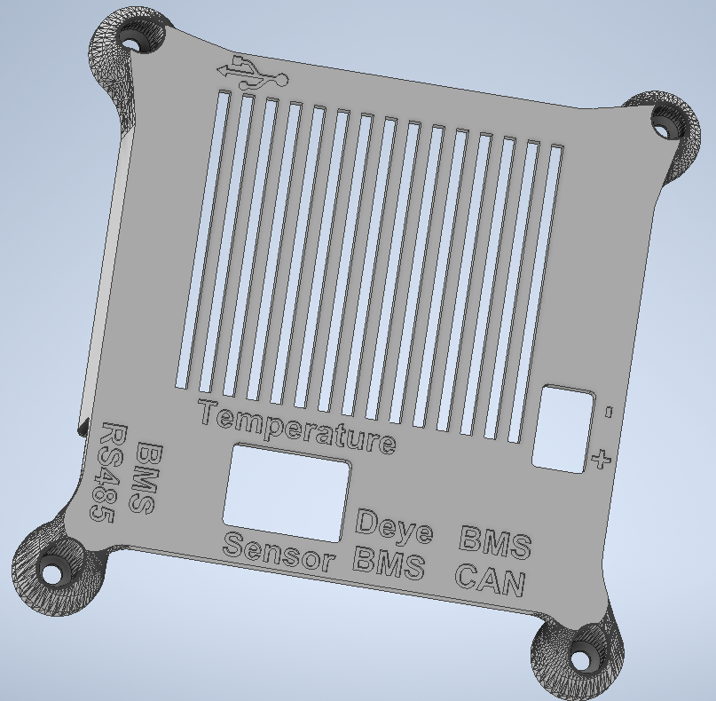

# Modified 3D Printed Case

I had a few changes that i wanted to do to the Case so i turned the stl's of the existing case into CAD files and made a few changes that some might like aswell and i think having options is better then not having them :D. So here you go. Below are some Pictures.

### Changes to the Bottom of the Case
The PCB's that I ordered were 2mm thick instead of the Standard ~1.5mm. So i adjusted the depth where the pcb sits in to accomodate the 2mm thick PCB's.

Additionally I like to use Heatset inserts instead of screwing into the plastic, but the previous holes were only 4mm. So i adjusted them to 4.7mm which is the perfect size for M3 Heatsets when printed in ABS. Should still work for PLA and other Materials.
### Changes to the Top of the Case
There was not really anything that needed changing, but I was not a fan of the MARK 4 Label and i wanted to lable the diffrent ports instead. So that's what i did, I added lables for the 3 Rj45 Ports, the Temperature sensor, + and - for the power Terminal aswell as a USB logo for the USB port of the ESP32.
To Fit the Lables a bit better, I made the cutouts for the screw Terminals a little bit smaller. Everything is still accessible.

You have a few options of how to print this:
- Print only the 'top.stl' and have the text and logo's engraved into the printed piece.
- Print it in multiple colors by importing all the stl files from the Folder 'MultiColor options' aswell as the top.stl from the 'top' folder at the same time and selecting 'yes' when asked if you want to import all the files as a Single Object with multiple Parts. If you do this, the logos will be automatically placed in the engraved parts of the case. If you do not do this, the logos will all just be put into the center of the slicer. (only works when the slicer is setup for Multi color Printing, otherwise it does not ask the question). This way you can give each of the Lables a diffrent color, i find this the best option to use myself.
- Print it in multiple colors by using the file 'top_with_labels_multicolor_split_to_parts.stl' from the subfolder 'Single_multicolor_file' under 'MultiColor options' and right clicking it in the Slicer and click 'split to multiple parts' and coloring each file as you like. This has the problem/benefit depending on how you view it, that it splits the text into its individual letters, so you could color each letter the word "BMS" in a diffrent color. Might be useful for someone, but i find this a bit cumbersome, but this way you only need to download one file instead of multiple.

I made a Picture as an example, with alot of colors, i only printed it in Black with green Logos, but you can customize or print in whatever combination of colors as you like.

### Multicolor

### No Color, just engraved

##### Case modified by:
- [xF4m3](https://github.com/xF4m3 "xF4m3")
